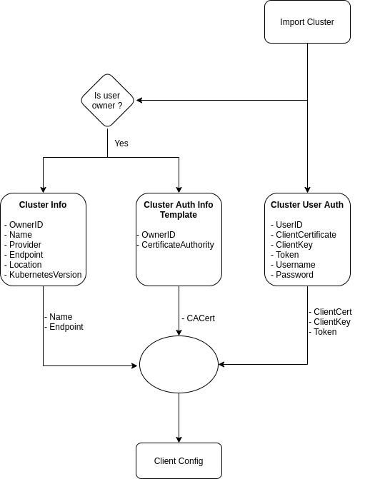

[](https://goreportcard.com/report/go.bytebuilders.dev/resource-model)
[](https://godoc.org/go.bytebuilders.dev/resource-model)
[](https://github.com/bytebuilders/resource-model/actions?workflow=CI)
[](https://slack.appscode.com)
[](https://twitter.com/intent/follow?screen_name=ByteBuilders)

# resource-model

[ByteBuilders](https://byte.builders) Resource Models



<center>Fig: Import Cluster Flow</center>


##  ClusterInfo

To show or to store basic cluster information for future reference, some public information is stored using `ClusterInfo` resource. The information that is stored is shown bellow.

```yaml
- Name
- UID
- OwnerID
- ExternalID
- Provider
- Endpoint
- Location
- Project
- KubernetesVersion
- NodeCount
```

## ClusterAuthInfoTemplate

This resource is actually a template for necessary data to connect to the cluster. It contains `CertificateAuthorityData` for the cluster and also `User authentication data` of the cluster owner. If the cluster provides `kube config`, then it's also stored. Only when the necessary information or `kube config` is provided, `ClusterAuthInfoTemplate` is stored.

```yaml
- UID
- OwnerID
- KubeConfig

- CertificateAuthorityData

- ClientCertificateData
- ClientKeyData

- Token

- Username
- Password
```

## ClusterUserAuth

This resource contains user specific authentication data. These data are used to create `kube config` for accessing the cluster. In some cases, the cluster provides `kube config` which is also stored by this resource. When an user imports a cluster, user specific credential is stored in `ClusterUserAuth` .

```yaml
- ClusterUID
- UserID
- KubeConfig

- ClientCertificateData
- ClientKeyData

- Token

- Username
- Password
```

Sometimes these direct authentication data isn't stored. Instead some auxiliary data are provided from which we can generate `Token` which can be used for accessing the cluster.

For example:

```yaml
# GKEProvider

- ClientID
- ClientSecret
- AccessToken
- RefreshToken
- Expiry
```

```yaml
# AWSProvider

- AccessKeyID
- SecretAccessKey
```

## CloudCredential

This resource is used to store credentials to list and import clusters.

Credential formats

```go
type GKECredential struct {
   ClientID     string
   ClientSecret string
   AccessToken  string
   RefreshToken string
   Scopes 		[]string
   Expiry 		int64
}

type GCECredential struct {
   ProjectID      string
   ServiceAccount string
}

type DigitalOceanCredential struct {
   Token string
}

type AzureCredential struct {
   TenantID       string
   SubscriptionID string
   ClientID       string
   ClientSecret   string
}

type AWSCredential struct {
   AccessKeyID     string
   SecretAccessKey string
}

type PacketCredential struct {
   ProjectID string
   APIKey    string
}

type ScalewayCredential struct {
   Organization string
   Token        string
}

type LinodeCredential struct {
   Token string
}

type VultrCredential struct {
   Token string
}
```
